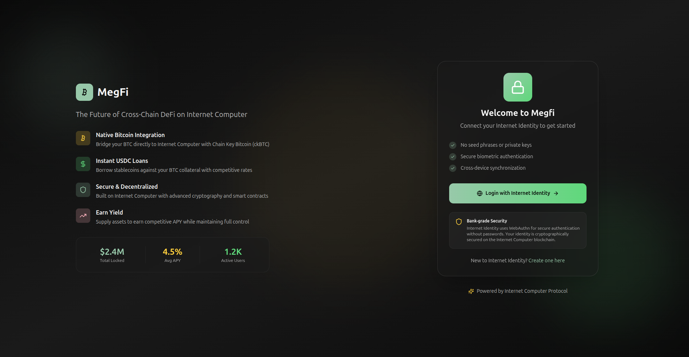
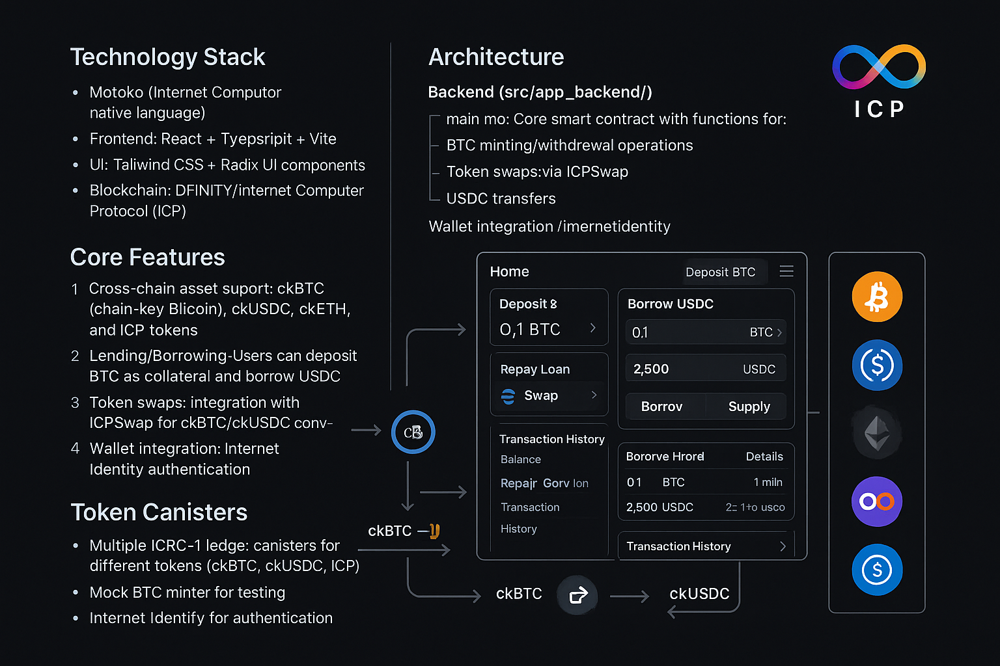
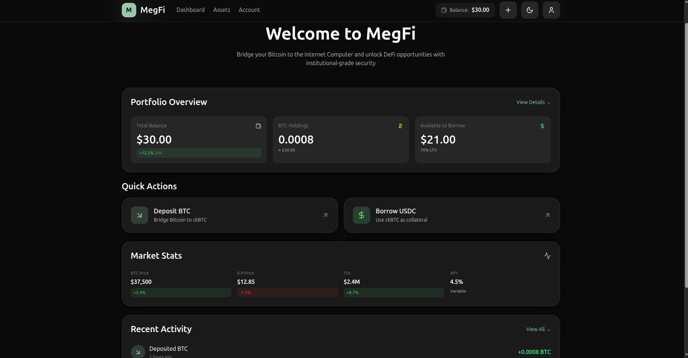
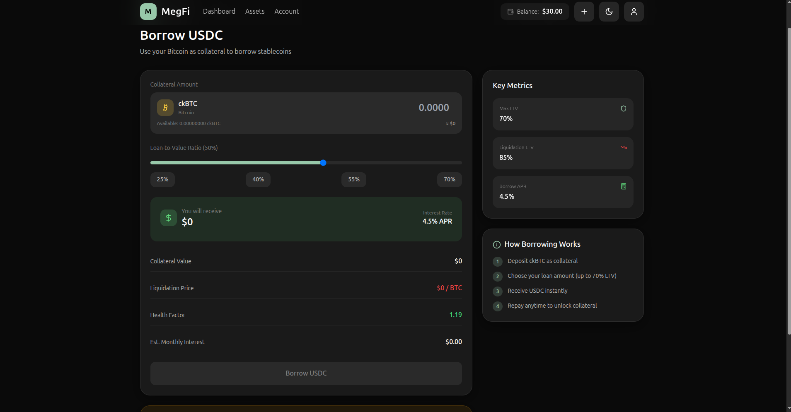
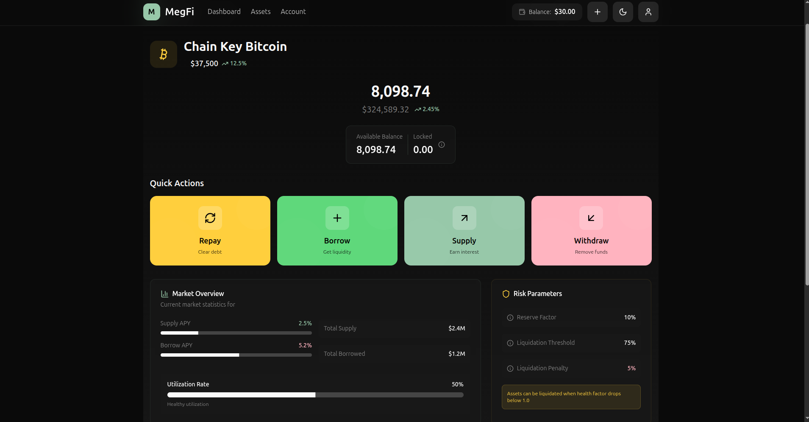
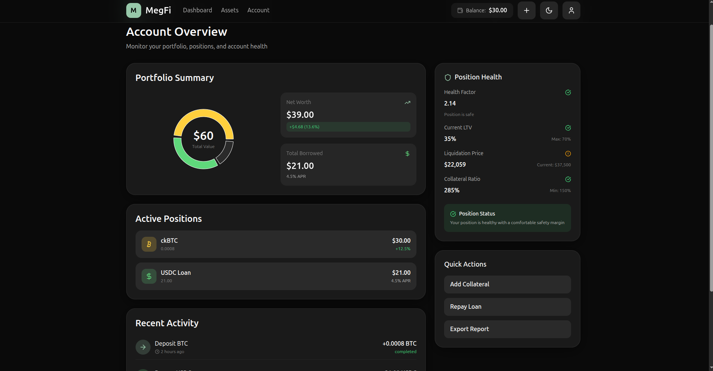

# MegFi

Welcome to MegFi, a Bitcoin DeFi application built on the Internet Computer Protocol (ICP). MegFi allows users to bridge Bitcoin to ckBTC, use it as collateral to borrow USDC, and participate in decentralized finance activities.

## Features

- **Bitcoin Bridging**: Convert Bitcoin to chain-key Bitcoin (ckBTC) on the ICP network
- **DeFi Lending**: Use deposited ckBTC as collateral to borrow ckUSDC stablecoins
- **Loan Management**: Repay loans and track account positions
- **Seamless Integration**: Built with Internet Identity for secure, decentralized authentication

### User Interface


_Secure authentication with Internet Identity_

To get started, you might want to explore the project directory structure and the default configuration file. Working with this project in your development environment will not affect any production deployment or identity tokens.

To learn more before you start working with MegFi, see the following documentation available online:

- [Quick Start](https://internetcomputer.org/docs/current/developer-docs/setup/deploy-locally)
- [SDK Developer Tools](https://internetcomputer.org/docs/current/developer-docs/setup/install)
- [Motoko Programming Language Guide](https://internetcomputer.org/docs/current/motoko/main/motoko)
- [Motoko Language Quick Reference](https://internetcomputer.org/docs/current/motoko/main/language-manual)

If you want to start working on your project right away, you might want to try the following commands:

```bash
dfx help
dfx canister --help
```

## Install Rust (cargo)

```bash
curl --proto '=https' --tlsv1.2 -sSf https://sh.rustup.rs | sh
```

## Install C compiler

```bash
sudo apt update
sudo apt install build-essential clang
```

## Running the project locally

If you want to test your project locally, you can use the following commands:

```bash
# install dependencies
npm i

# Starts the replica, running in the background
dfx start --background

# Deploys your canisters to the replica and generates your candid interface
dfx deploy
```

If errors try:

```bash
dfx stop && sudo rm -rf node_modules .dfx && dfx start —-clean --background && dfx deploy
```

Once the job completes, your application will be available at `http://localhost:4943?canisterId={asset_canister_id}`.

If you have made changes to your backend canister, you can generate a new candid interface with

```bash
npm run generate
```

at any time. This is recommended before starting the frontend development server, and will be run automatically any time you run `dfx deploy`.

If you are making frontend changes, you can start a development server with

```bash
npm start
```

Which will start a server at `http://localhost:8080`, proxying API requests to the replica at port 4943.

### Note on frontend environment variables

If you are hosting frontend code somewhere without using DFX, you may need to make one of the following adjustments to ensure your project does not fetch the root key in production:

- set`DFX_NETWORK` to `ic` if you are using Webpack
- use your own preferred method to replace `process.env.DFX_NETWORK` in the autogenerated declarations
  - Setting `canisters -> {asset_canister_id} -> declarations -> env_override to a string` in `dfx.json` will replace `process.env.DFX_NETWORK` with the string in the autogenerated declarations
- Write your own `createActor` constructor

## Adding a New Canister

Follow these steps to add a new canister to your project:

1. Create a new directory in the `src` folder for your canister:

```bash
mkdir src/my_canister
```

2. Add your canister files (e.g., main.mo for Motoko or lib.rs for Rust) to the new directory.

3. Update `dfx.json` to include your new canister:

```json
{
  "canisters": {
    "my_canister": {
      "type": "motoko", // or "rust" or "custom"
      "main": "src/my_canister/main.mo" // for Motoko
      // For Rust canisters:
      // "type": "custom",
      // "candid": "src/my_canister/my_canister.did",
      // "wasm": "target/wasm32-unknown-unknown/release/my_canister.wasm",
      // "build": "src/my_canister/build.sh"
    }
  }
}
```

4. Add the declaration route in `vite.config.js`:

```javascript
resolve: {
  alias: [
    // Add your new canister declaration
    {
      find: "mydec",  // choose your alias
      replacement: fileURLToPath(
        new URL("../declarations/my_canister", import.meta.url)
      ),
    },
    // ... other aliases
  ],
}
```

5. Test your canister:

```bash
# Deploy your canister
dfx deploy my_canister

# Verify the declarations were generated
ls .dfx/local/canisters/my_canister/
```

6. Import and use your canister in frontend components:

```javascript
import { canister } from "mydec"; // using the alias defined in vite.config.js
```

## Overview of the Codebase

This is a DeFi lending/borrowing application built on the Internet Computer blockchain. Here's the structure:



### Technology Stack

- Backend: Motoko (Internet Computer's native language)
- Frontend: React + TypeScript + Vite
- UI: Tailwind CSS + Radix UI components
- Blockchain: DFINITY/Internet Computer Protocol (ICP)

### Core Features

1. Cross-chain asset support: ckBTC (chain-key Bitcoin), ckUSDC, ckETH, and ICP tokens
2. Lending/Borrowing: Users can deposit BTC as collateral and borrow USDC
3. Token swaps: Integration with ICPSwap for ckBTC/ckUSDC conversions
4. Wallet integration: Internet Identity authentication


_Main dashboard showing portfolio overview and asset management_

### Architecture

**Backend (src/app_backend/)**

- main.mo: Core smart contract with functions for:
  - BTC minting/withdrawal operations
  - Token swaps via ICPSwap
  - USDC transfers
  - Collateralized borrowing

**Frontend (src/app_frontend/)**

- Modern React app with routing
- Key pages: Home, Deposit BTC, Borrow USDC, Repay Loan, Account Overview
- Components for lending dashboard, forms (borrow/supply/repay/withdraw), transaction history
- Extensive UI component library based on Radix UI
- Custom hooks for actors, authentication, and mobile detection


_Borrowing interface with collateral management and LTV controls_

**Token Canisters**

- Multiple ICRC-1 ledger canisters for different tokens (ckBTC, ckUSDC, ICP)
- Mock BTC minter for testing
- Internet Identity for authentication

The app enables users to deposit Bitcoin, receive ckBTC, use it as collateral to borrow ckUSDC, and manage their lending positions through a modern web interface.

## Screenshots

### Asset Management


_Detailed view of individual assets with deposit and withdrawal options_

### Account Overview


_Comprehensive account view showing positions, collateral, and borrowing status_

### Team Introduction

We are a dedicated team of two blockchain developers passionate about bringing Bitcoin DeFi to the Internet Computer ecosystem. CodeMicah and Kcpele

### Motivation/Problem Statement

Bitcoin holders want to access DeFi opportunities without selling their BTC, current cross-chain solutions are complex or centralized.

### Solution Description

leveraging ICP's chain-key technology for trustless BTC bridging, providing a simple interface for collateralized lending, enabling Bitcoin holders to maintain exposure while accessing liquidity,

### Future Roadmap

- Mobile app
- Additional collateral types
- More borrowing options
- Yield strategies
- Governance features
